 

&nbsp;

 

## Selected work

<b>All 42 repositories</b>

 

**Offensive tooling**

| | Repository | What it does |
|---|---|---|
| 12★ | **[endpointhunter](https://github.com/Mr-Destroyer/endpointhunter)** | Bug-bounty endpoint discovery |
| 12★ | **[villain](https://github.com/Mr-Destroyer/villain)** | Undetectable payload/shell generator |
| 10★ | **[CredStalker-](https://github.com/Mr-Destroyer/CredStalker-)** | Automated credential hunting |
| 9★ | **[vulnx](https://github.com/Mr-Destroyer/vulnx)** | Auto vulnerability finder + shell injector |
| 6★ | **[Fucker](https://github.com/Mr-Destroyer/Fucker)** | Web application vulnerability scanner |
| 3★ | **[WPGhost](https://github.com/Mr-Destroyer/WPGhost)** | WordPress scanner/exploiter |
| 2★ | **[ALL_IN_ONE](https://github.com/Mr-Destroyer/ALL_IN_ONE)** | Multi-tool launcher |
| 2★ | **[EmailSpoofer](https://github.com/Mr-Destroyer/EmailSpoofer)** | SMTP spoofing |
| 1★ | **[SQLZ](https://github.com/Mr-Destroyer/SQLZ)** | SQL injection toolkit |
| 1★ | **[HashDog](https://github.com/Mr-Destroyer/HashDog)** | Hash cracking |
| 1★ | **[DIONAEA_FTP_SCANNER](https://github.com/Mr-Destroyer/DIONAEA_FTP_SCANNER)** | Honeypot FTP testing |
| 1★ | **[God_Scanner](https://github.com/Mr-Destroyer/God_Scanner)** | Scanner |
| 0★ | **[ZimPwn](https://github.com/Mr-Destroyer/ZimPwn)** | LFI/RFI scanner |
| 0★ | **[JWT-MODIFY](https://github.com/Mr-Destroyer/JWT-MODIFY)** | JWT payload tampering |
| 0★ | **[sessionexploit](https://github.com/Mr-Destroyer/sessionexploit)** | Cookie/session decoding |
| 0★ | **[XSStriker](https://github.com/Mr-Destroyer/XSStriker)** | XSS testing |
| 0★ | **[CVE-2025-55182](https://github.com/Mr-Destroyer/CVE-2025-55182)** | PoC for the RCE/command-injection CVE |
| 0★ | **[Admin-Finder](https://github.com/Mr-Destroyer/Admin-Finder)** | Admin panel discovery (Perl) |
| 0★ | **[ZForce](https://github.com/Mr-Destroyer/ZForce)** | Social-media brute force |
| 0★ | **[wifi_hacker](https://github.com/Mr-Destroyer/wifi_hacker)** | Wi-Fi auditing (Windows) |

**Utilities & platform**

| | Repository | What it does |
|---|---|---|
| 2★ | **[MobiToolKit](https://github.com/Mr-Destroyer/MobiToolKit)** | Android device tooling |
| 2★ | **[Keylogger](https://github.com/Mr-Destroyer/Keylogger)** | C++ keylogger |
| 2★ | **[ufonet](https://github.com/Mr-Destroyer/ufonet)** | DoS tooling |
| 1★ | **[ZimMux](https://github.com/Mr-Destroyer/ZimMux)** | One-file tmux theme |
| 1★ | **[ZIMTHEGOAT](https://github.com/Mr-Destroyer/ZIMTHEGOAT)** | HyDE desktop theme |
| 0★ | **[git-dumper](https://github.com/Mr-Destroyer/git-dumper)** | Fast `.git` dumper (Go) |
| 0★ | **[Jarvis_Zim](https://github.com/Mr-Destroyer/Jarvis_Zim)** | Text-to-speech assistant |
| 0★ | **[DigitalSparkUsbController](https://github.com/Mr-Destroyer/DigitalSparkUsbController)** | USB Rubber Ducky scripts |
| 0★ | **[PageKite](https://github.com/Mr-Destroyer/PageKite)** | Reverse proxy for exposing local servers |

**Write-ups & coursework**

| Repository | Topic |
|---|---|
| **[0x41haz-writeup](https://github.com/Mr-Destroyer/0x41haz-writeup)** | Reverse-engineering walkthrough |
| **[XXE-INJECTION](https://github.com/Mr-Destroyer/XXE-INJECTION)** | XXE walkthrough (BugForge) |
| **[phantom-fob-tryhackme](https://github.com/Mr-Destroyer/phantom-fob-tryhackme)** | TryHackMe room walkthrough |
| **[justavpnlogin](https://github.com/Mr-Destroyer/justavpnlogin)** | TryHackMe room walkthrough |
| **[cybersecurity_course](https://github.com/Mr-Destroyer/cybersecurity_course)** | Beginner security course |
| **[course_manual](https://github.com/Mr-Destroyer/course_manual)** | Course material |

**Web & misc**

| Repository | What it is |
|---|---|
| **[ZimShell](https://github.com/Mr-Destroyer/ZimShell)** | Portfolio site |
| **[portfolio](https://github.com/Mr-Destroyer/portfolio)** | Portfolio site |
| **[DarkWeb](https://github.com/Mr-Destroyer/DarkWeb)** | HTML/CSS/JS demo page |
| **[CALCULATOR](https://github.com/Mr-Destroyer/CALCULATOR)** | Python calculator |
| **[Ransomware](https://github.com/Mr-Destroyer/Ransomware)** | Ransomware simulation |
| **[DDos_Zim](https://github.com/Mr-Destroyer/DDos_Zim)** | DoS tooling |
| **[FB-Hack](https://github.com/Mr-Destroyer/FB-Hack)** | Facebook tooling |

Repos with a zero star count are still listed — the count is a popularity signal, not a quality one, and this list is meant to be complete.

 

## Numbers

Languages are counted **by repository**, not by bytes. Byte counts are misleading here: one vendored 15 MB JavaScript tool outweighs every line of Python in the account, which would put JavaScript first. Counting repos answers the more useful question — what does this person actually build?

 

## Terminal

 

### Contact

  

Open to everyone — questions, collaborations, or just talking shop.

Spamming is not Hacking lil bro [He he]

  

<i>"Every system has a weakness. 
You just have to find it."</i>

 

---

<b>How this page works.</b> Every figure above is computed from the live GitHub API and committed daily by <a href=".github/workflows/profile.yml">a scheduled Action</a> — nothing here is hand-typed, so it cannot drift out of date. The assets are generated by the Python in <a href="scripts/">scripts/</a>. They are self-hosted rather than embedded from third-party badge services, which is why they keep working when those services go down.
